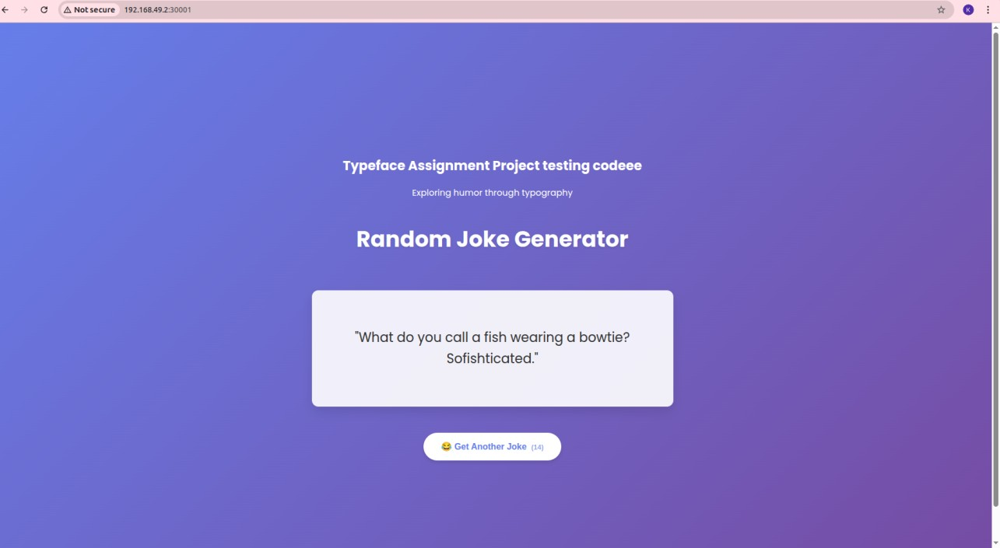

# 🤣 Random Joke App with Azure DevOps + Minikube + Docker Hub

This is a full-stack web application that serves random jokes using a backend API and a frontend UI.

---

## 📸 Screenshot



---

## Project Structure

random-joke-azure/
├── k8s/ # Kubernetes manifests
│ ├── backend-deployment.yaml
│ ├── backend-service.yaml
│ ├── frontend-deployment.yaml
│ └── frontend-service.yaml
├── rja-backend/ # Node.js backend API
│ ├── Dockerfile
│ └── server.js
├── rja-frontend/ # React frontend
│ ├── Dockerfile
│ └── src/App.js
├── azure-pipelines.yml # Azure DevOps pipeline file
└── README.md # You are here


---

## Features

- Full-stack app using Node.js + React
- Containerized with Docker
- CI/CD pipeline using Azure DevOps
- Docker images pushed to Docker Hub
- Deployed to Minikube (locally running Kubernetes) from a **self-hosted Azure agent**

---

##  Prerequisites

- Docker Hub account (with a **repository created** for frontend and backend)
- Minikube running locally
- Azure DevOps project and pipeline
- Self-hosted agent configured to run on the local machine with `kubectl` and `docker` access

---

## Run Locally 
If you want to test locally without Azure:

```bash
# Start minikube
minikube start

# Build images locally
cd rja-backend && docker build -t joke-backend:latest .
cd ../rja-frontend && docker build -t joke-frontend:latest .

# Apply manifests
kubectl apply -f k8s/

# Azure DevOps CI/CD with Minikube and Docker

This project sets up a complete CI/CD pipeline using Azure DevOps, Docker, and Minikube for deploying a frontend and backend application to a local Kubernetes cluster.

##  Azure Pipeline File

See `azure-pipelines.yml` for the complete CI/CD configuration.

### Prerequisites for Azure DevOps Agent

Make sure your self-hosted Azure DevOps agent (running locally) has:

- `kubectl` configured with access to **Minikube**
- `docker` installed and logged in to **Docker Hub**

##  Kubernetes Manifest Notes

Each file in the `k8s/` directory is responsible for deploying and exposing your app:

- `*-deployment.yaml`: Defines the deployment using your Docker image.
- `*-service.yaml`: Exposes the service via **NodePort** for Minikube access.

##  Accessing the App

Once the Azure pipeline completes successfully, you can view your app using:

minikube service joke-frontend-service


